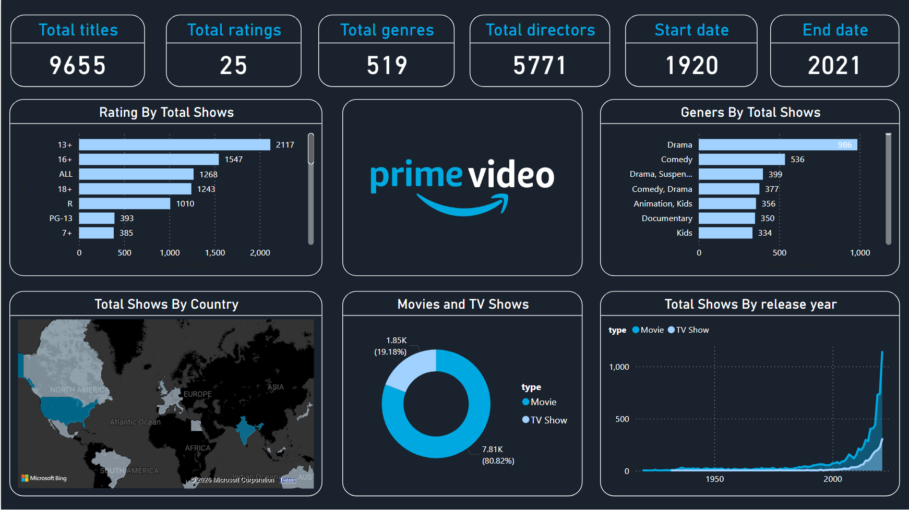

# Amazon Prime Video Dashboard (Power BI)

## Project Overview
This project presents an interactive **Power BI dashboard** analyzing the **Amazon Prime Movies and TV Shows dataset**. The goal of this project is to explore content trends, distribution, and key insights from the catalog of movies and TV shows available on Amazon Prime.

The dashboard helps answer questions such as:

- How many movies vs TV shows are available?
- How has content production changed over time?
- Which genres are most common?
- What ratings dominate the platform?
- Which countries produce the most content?

---

## Dataset
The dataset contains information about titles available on Amazon Prime Video, including details about the content, production, and classification.

### Main Features
- Title
- Director
- Cast
- Country
- Release Year
- Date Added
- Rating
- Duration
- Genre (Listed In)
- Description
- Type (Movie or TV Show)

---

## Project Objectives
The main objectives of this project are:

- Perform **data cleaning and transformation** using Power Query
- Create **interactive dashboards** to explore content distribution
- Identify **trends in release years and content production**
- Analyze **ratings and genre patterns**
- Build a **portfolio Power BI project** demonstrating data visualization and BI skills

---

## Tools & Technologies
This project was developed using:

- **Power BI**
- **Power Query** for data cleaning
- **DAX** for calculated measures
- Data visualization techniques

---

## Dashboard Features

### Content Overview
- Total number of titles
- Number of Movies vs TV Shows

### Release Trends
- Distribution of titles by **release year**
- Trend of content growth over time

### Genre Analysis
- Most common genres available on the platform
- Distribution of genres across titles

### Ratings Distribution
- Content classification by rating categories

### Country Distribution
- Countries producing the most content on Amazon Prime

### Duration Analysis
- Movie duration distribution
- TV show season insights

---

## Key Insights
Some insights observed from the analysis include:

- Movies represent the majority of titles compared to TV Shows.
- Content production has significantly increased after **2015**.
- Genres such as **Drama and Comedy** are among the most frequent.
- A few countries contribute a large portion of the available titles.

---

---

## Dashboard Preview

---

## How to Use This Project

1. Download or clone this repository
2. Open the `.pbix` file using **Power BI Desktop**
3. Explore the interactive dashboard and filters

---

## Future Improvements

Possible extensions for this project include:

- Sentiment analysis on title descriptions
- Recommendation system experiments
- Comparison with other streaming platforms
- More advanced DAX KPIs and measures

---

## Author

**Hamed Goldoust**

Power BI | Data Analytics | Data Scientist

GitHub: https://github.com/Clonerhamed
LinkedIn: https://linkedin.com/in/hamed-goldoust/
